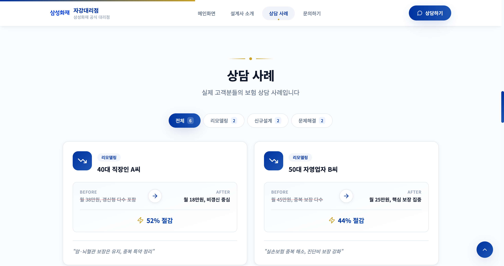
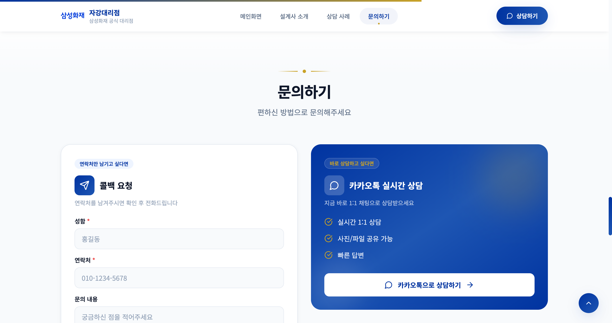

# 삼성화재 자강대리점 - 프로필 웹사이트

> React 19 + Vite + TypeScript + TailwindCSS 기반 반응형 SPA

<br/>

## 배포 링크

**[https://jagang.jinproject.xyz](https://jagang.jinproject.xyz)**

<br/>

## 기술 스택

<div align="center">
  
  
  
  
  
  
  
</div>

<br/>

---

## 스크린샷

| 메인 | 소개 |
|:---:|:---:|
|  |  |

| 상담 사례 | 문의하기 |
|:---:|:---:|
|  |  |

<br/>

---

## 프로젝트 구조

```
src/
├── components/
│   ├── App.tsx              # 루트 컴포넌트
│   ├── Header.tsx           # 헤더 (네비게이션)
│   ├── NavBar.tsx           # PC 네비게이션
│   ├── MobileNav.tsx        # 모바일 네비게이션
│   ├── Home.tsx             # 히어로 섹션
│   ├── About.tsx            # 소개 섹션
│   ├── Cases.tsx            # 상담 사례 섹션
│   ├── CaseCard.tsx         # 사례 카드
│   ├── Contact.tsx          # 문의 섹션
│   ├── Footer.tsx           # 푸터
│   ├── Title.tsx            # 섹션 타이틀
│   ├── ScrollProgress.tsx   # 스크롤 진행률 바
│   ├── TiltCard.tsx         # 3D 틸트 카드
│   └── MagneticButton.tsx   # 마그네틱 버튼
├── hooks/
│   ├── useInView.ts         # Intersection Observer 훅
│   ├── useCountUp.ts        # 숫자 카운트업 훅
│   └── useScrollToUpdateUrl.ts
├── data/
│   └── cases.ts             # 상담 사례 데이터
├── types/
│   └── index.ts             # 타입 정의
├── index.css                # 글로벌 스타일 + 애니메이션
└── main.tsx                 # 진입점
```

<br/>

## 주요 구현

### 커스텀 훅

| 훅 | 설명 |
|----|------|
| `useInView` | Intersection Observer 기반 뷰포트 진입 감지 |
| `useCountUp` | 숫자 카운트업 애니메이션 (ease-out) |
| `useScrollToUpdateUrl` | 스크롤 위치에 따른 URL 해시 업데이트 |

### 인터랙티브 컴포넌트

| 컴포넌트 | 설명 |
|----------|------|
| `TiltCard` | 마우스 위치 기반 3D 기울기 + 글레어 효과 |
| `MagneticButton` | 마우스를 따라 이동하는 버튼 |
| `ScrollProgress` | 페이지 스크롤 진행률 표시 |

### 애니메이션 (TailwindCSS)

```css
fade-in-up      /* 아래에서 위로 페이드 인 */
slide-in-left   /* 좌측에서 슬라이드 */
slide-in-right  /* 우측에서 슬라이드 */
scale-in        /* 확대되며 나타남 */
float           /* 부유 효과 */
pulse-glow      /* 글로우 효과 */
```

<br/>

## SEO

- **메타 태그**: title, description, keywords, Open Graph, Twitter Card
- **JSON-LD**: LocalBusiness, Person, Service, FAQPage, BreadcrumbList
- **기타**: robots.txt, sitemap.xml, manifest.json (PWA)

<br/>

## 실행 방법

```bash
# 개발 서버
npm install
npm run dev

# 프로덕션 빌드
npm run build
npm run preview

# Docker 배포
docker build -t jagang-web .
docker run -p 8003:80 jagang-web
```

<br/>

## 배포 환경

| 항목 | 값 |
|------|-----|
| 서버 | AWS EC2 |
| 컨테이너 | Docker + Nginx |
| 도메인 | jagang.jinproject.xyz |
| SSL | ACM 와일드카드 인증서 |

<br/>

## 외부 연동

| 서비스 | 엔드포인트 |
|--------|------------|
| 문의 폼 API | `POST https://pium.jinproject.xyz/api/email/contact` |
| 카카오톡 채널 | `http://pf.kakao.com/_wxefFn` |
